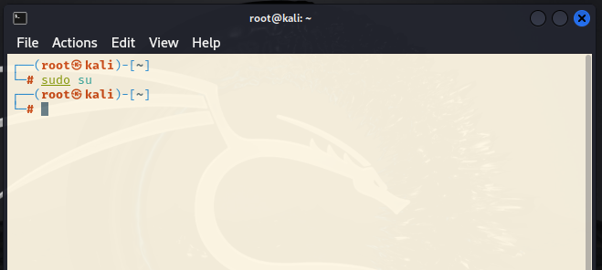
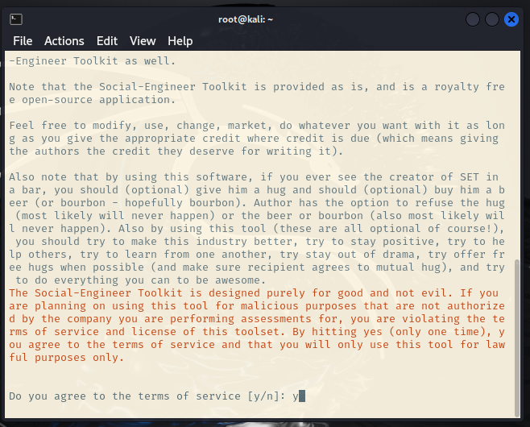

# Phishing para captura de senhas do Instagram
### Ferramentas

- Kali Linux
- setoolkit

### Configurando o Phishing no Kali Linux

1º Abra o terminal, e digite: sudo su
###


2º Digite: setoolkit, e na tela seguinte confirme com: y
###


: ``` setoolkit ```
- Tipo de ataque: ``` Social-Engineering Attacks ```
- Vetor de ataque: ``` Web Site Attack Vectors ```
- Método de ataque: ```Credential Harvester Attack Method ```
- Método de ataque: ``` Site Cloner ```
- Obtendo o endereço da máquina: ``` ifconfig ```
- URL para clone: https://webmail-seguro.com.br/

### Resutados


