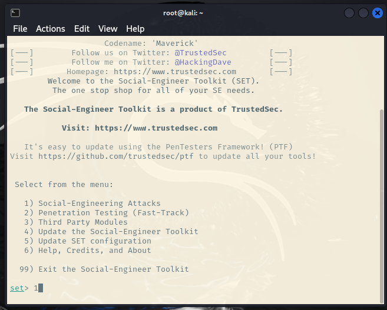
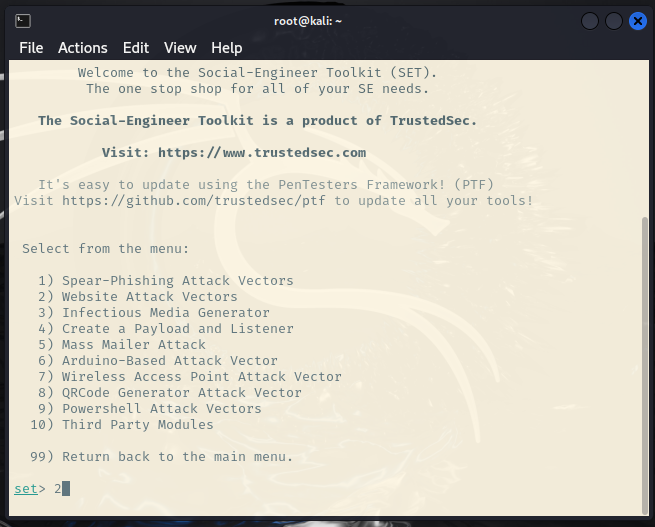
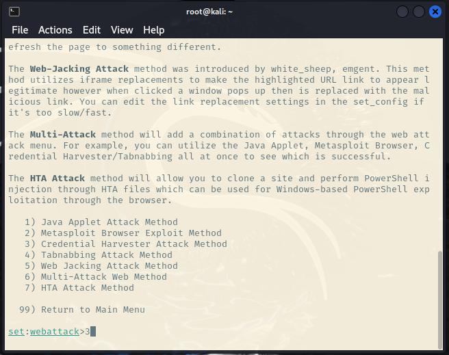
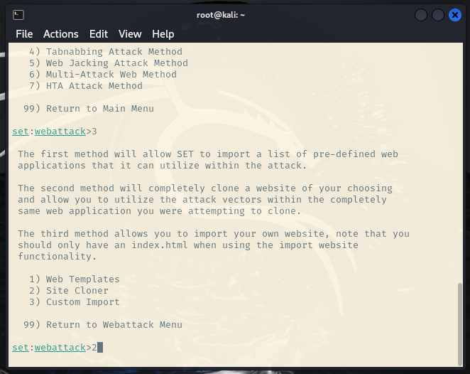
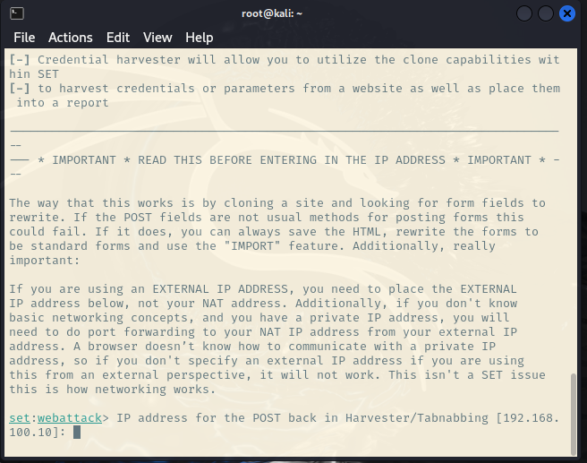
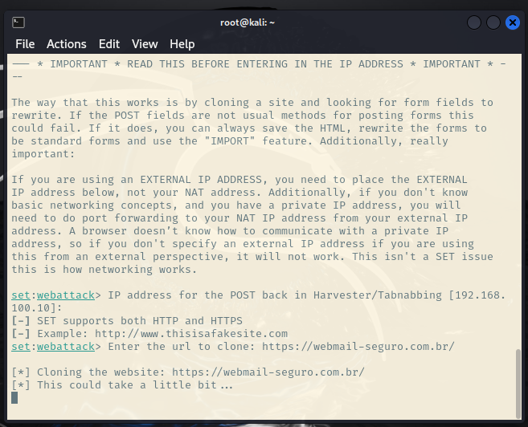
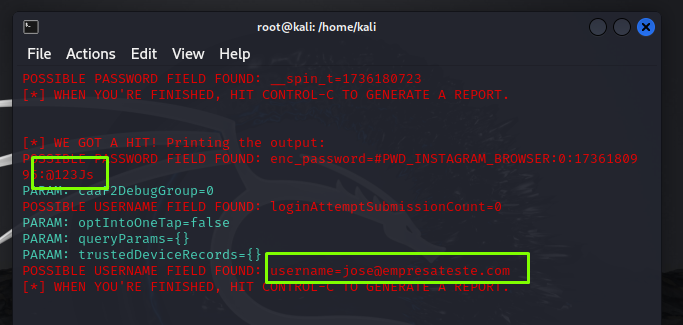

# Phishing para captura de senhas do Instagram
### Ferramentas

- Kali Linux
- setoolkit

### Configurando o Phishing no Kali Linux

1º Abra o terminal, e digite: sudo su
###

2º Digite: setoolkit, e na tela seguinte confirme com: y
###

3º Na próxima tela escolha a opção: 1 - Social-Engineering Attacks
###

3º Na tela seguinte escolha a opção: 2 - Web Site Attack Vectors
###

3º Na próxima tela digite a opção: 3 - Credential Harvester Attack Method
###

4º Na ultima opção digite: 2 - Site Cloner
###

4º Já na próxima tela, você confirma o ip que irá rodar o sevidor com a pagina fake, apenas tecle enter
###

4º No exemplo abaixo, foi utilizado o site do instagram
###

4º E os dados de e-mail e senha estão disponiveis em seguida, como mostra na imagem abaixo:
###

